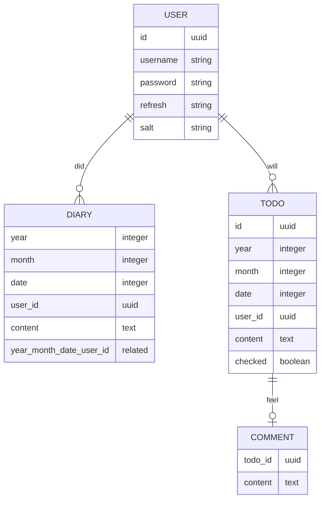

# 오늘의 하늘

- [오늘의 하늘](#오늘의-하늘)
  - [Page](#page)
  - [API](#api)
  - [DB](#db)

## Page

[Today Sky FE](https://github.com/2chanhaeng/today-sky-fe) 로 이동.

## API

<table>
  <thead>
    <tr>
      <th>Path</th>
      <th>Method</th>
      <th>Params</th>
      <th>Data</th>
      <th>CRUD</th>
    </tr>
  </thead>
  <tbody>
    <tr>
      <td>/diary/<code>year</code>/<code>month</code></td>
      <td>GET</td>
      <td><code>year</code>, <code>month</code></td>
      <td><code>year</code>년 <code>month</code> 월 일기</td>
      <td>READS</td>
    </tr>
    <tr>
      <td rowspan="3">/diary/<code>year</code>/<code>month</code>/<code>date</code></td>
      <td>GET</td>
      <td rowspan="3"><code>year</code>, <code>month</code>, <code>date</code></td>
      <td rowspan="3"><code>year</code>년 <code>month</code> 월 <code>date</code> 일 일기</td>
      <td>READ</td>
    </tr>
    <tr>
      <td>POST</td>
      <td>CREATE, UPDATE</td>
    </tr>
    <tr>
      <td>DELETE</td>
      <td>DELETE</td>
    </tr>
    <tr>
      <td>/todo/<code>year</code>/<code>month</code></td>
      <td>GET</td>
      <td><code>year</code>, <code>month</code></td>
      <td><code>year</code>년 <code>month</code> 월 할 일</td>
      <td>READS</td>
    </tr>
    <tr>
      <td rowspan="2">/todo/<code>year</code>/<code>month</code>/<code>date</code></td>
      <td>GET</td>
      <td rowspan="2"><code>year</code>, <code>month</code>, <code>date</code></td>
      <td rowspan="2"><code>year</code>년 <code>month</code> 월 <code>date</code> 일 할 일</td>
      <td>READS</td>
    </tr>
    <tr>
      <td>POST</td>
      <td>CREATE</td>
    </tr>
    <tr>
      <td rowspan="3">/todo/<code>todo_id</code></td>
      <td>PUT</td>
      <td rowspan="3"><code>todo_id</code></td>
      <td rowspan="3"><code>todo_id</code>번 할 일</td>
      <td>UPDATE (content)</td>
    </tr>
    <tr>
      <td>PATCH</td>
      <td>UPDATE (checked)</td>
    </tr>
    <tr>
      <td>DELETE</td>
      <td>DELETE</td>
    </tr>
    <tr>
      <td rowspan="3">/todo/comment/<code>todo_id</code></td>
      <td>POST</td>
      <td rowspan="3"><code>todo_id</code></td>
      <td rowspan="3"><code>todo_id</code> 번 할 일 소감</td>
      <td>CREATE</td>
    </tr>
    <tr>
      <td>PUT</td>
      <td>UPDATE</td>
    </tr>
    <tr>
      <td>DELETE</td>
      <td>DELETE</td>
    </tr>
  </tbody>
</table>

## DB

